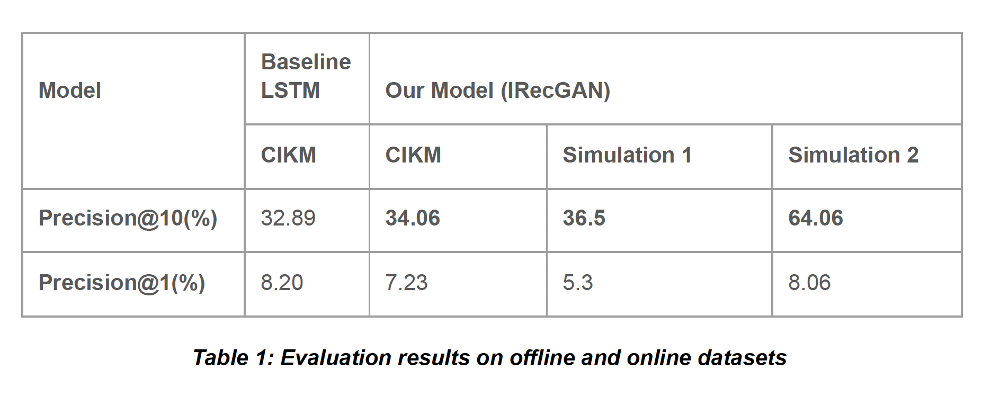

# Recommendation System using Reinforcement Learning with Generative Adversarial Training

Recommendation systems are widely used in online platforms. Reinforcement Learning
is well suited for recommendation systems as they allow the recommendation engine to
learn policies that maximize user’s overall long-term satisfaction without sacrificing the
recommendation’s short term utility. Current solutions mostly focus on model-free
approaches, which require frequent interactions with the real environment, and thus are
expensive. We use a model-based reinforcement learning solution called IRecGAN 
which models user-agent interaction for offline policy learning via a generative
adversarial network. To reduce bias in the learned model and policy, we use a
discriminator to evaluate the quality of generated data and scale the generated rewards.

Our experiments were conducted in both online and offline environments. Subject to the
difficulty of deploying a recommender system with real users for online evaluation, we used
simulation-based studies to first investigate the effectiveness of our approach.  We used 2 different simulations to model online user interaction. The details about the simulations can be found in the [Final Project Report](Final%20Project%20Report.pdf).
The instructions to run each of the simulations can be found in the corresponding READMEs

- [Simulation 1 and offline CIKM dataset](rl_rec_simulation_1/README.md)

- [Simulation 2](rl_rec_simulation_2/README.md)

We trained our model on both the simulation datasets as well as the offline CIKM dataset for 10
epochs to recommend top-1 and top-10 items.

## Evaluation

The results of our experiments are as follows,

